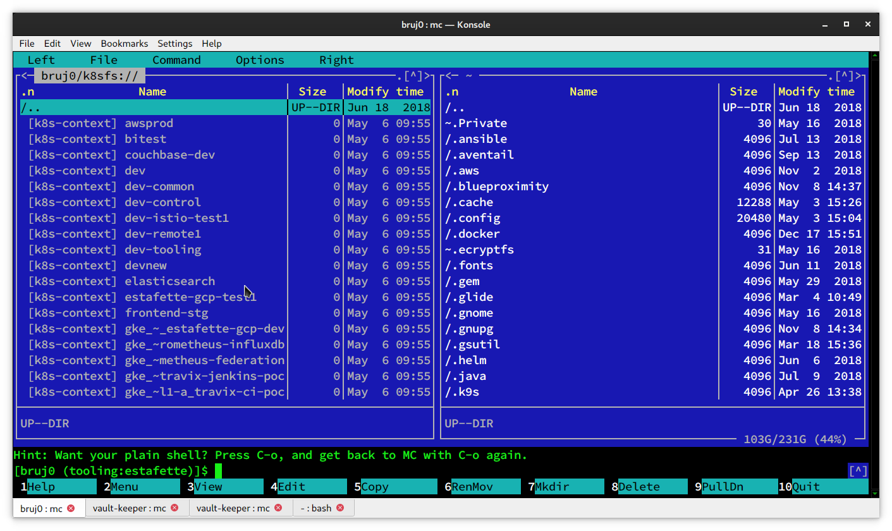
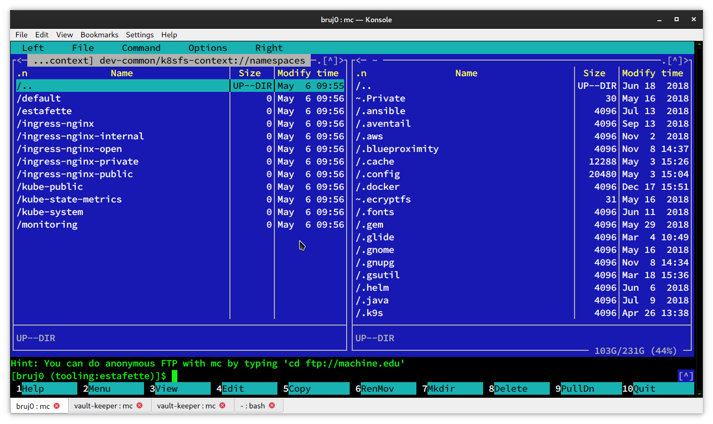
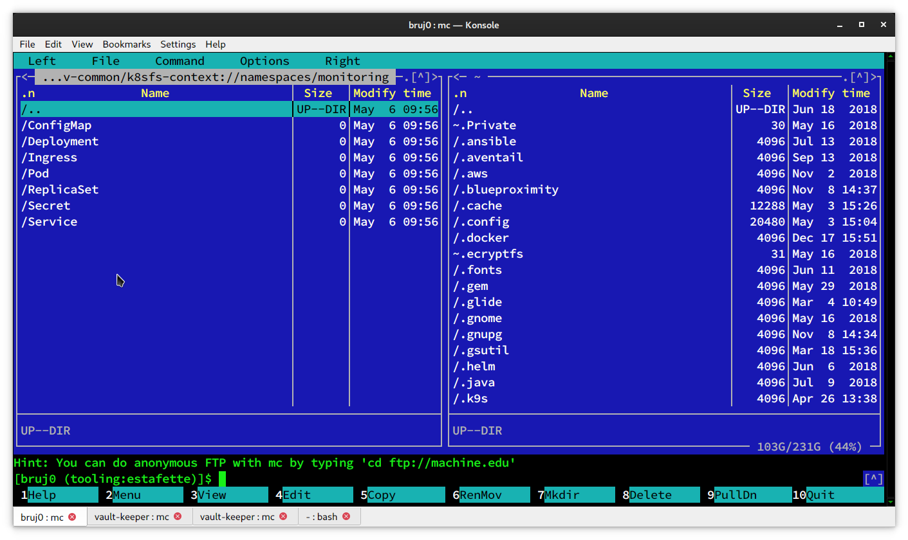
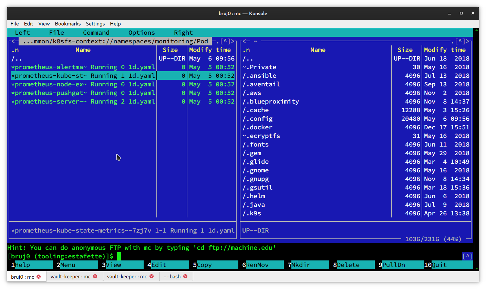
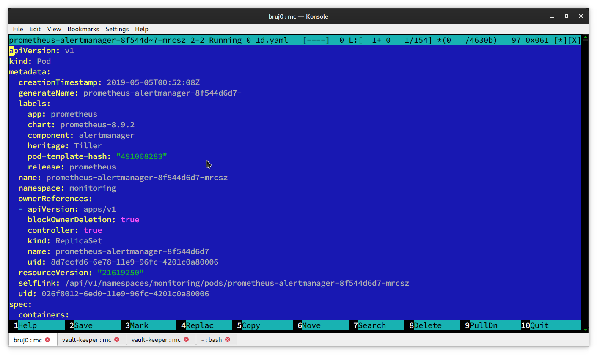

# Kubernetes Virtual filesystem for Midnight Commander

This extension to MC shows the API object as files. 
The main objective is to cut down on the time spent typing kubectl commands.

 1. Kubectl contexts
 
 2. Namespaces 
 
 3. ConfigMaps, Deplooyents, Ingress, Pods, Replicasets, Secrets and Services 
 4. Pod status 
 
 5. Pod Object description  
  


# Installation 

Copy k8sfs+ and k8sfs-context to
```shell
~/.local/share/mc/extfs.d
```

Add this:
```
regex/^\[k8s-context\]
	Open=%cd %p/k8sfs-context://
```

To the top of:
```shell
~/.config/mc/mc.ext
```

# Usage
Execute: cd k8sfs://
